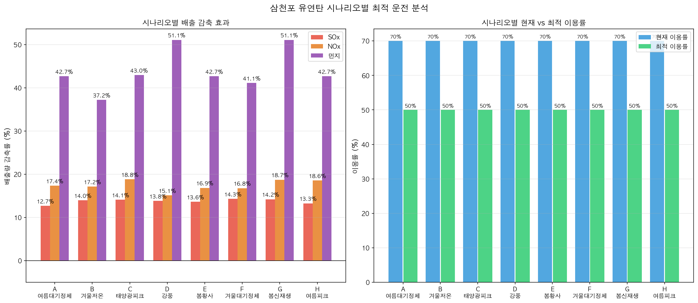

# Ⅰ. 과제 개요 및 가설

---

## 1. 분석 배경

### 1.1 규제 환경의 강화

우리나라 석탄화력발전소는 전국 SOx(황산화물), NOx(질소산화물), 먼지 배출의 상당 부분을 차지하는 주요 배출원이다. 정부는 2019년부터 **계절관리제(매년 12~3월)**를 시행하여 석탄발전 가동률 상한을 80%로 제한하고 있으며, 대기관리권역법 시행으로 배출허용기준도 지속 강화되고 있다.

한국남동발전은 삼천포(3,240 MW), 영흥(5,080 MW), 영동(400 MW), 여수(680 MW) 등 다수의 석탄·바이오매스 발전소와 분당 복합(LNG, 890 MW) 발전소를 운영하고 있다. 이들 사업소의 대기오염물질 배출을 사전에 예측하고 기상 조건에 맞는 발전 운영 전략을 수립하는 것은 환경 규제 준수와 사회적 비용 절감 양면에서 중요하다.


### 1.2 문제 인식

현재 발전소 운영은 **전력 수요 대응** 위주로 이루어지며, 대기오염물질 배출이 많은 기상 조건(대기정체·고온·약풍)에서도 발전 이용률 조정이 사전에 이루어지지 않는 경우가 있다. 특히:

- **대기정체** 시 오염물질 확산이 억제되어 지표 농도가 급증하나, 이에 맞춘 감발 기준이 부재
- **계절관리제** 기간 중 실제 이용률 제한 근거가 직관적·정성적 수준에 머물러, 데이터 기반 정량화 필요
- 기상 조건과 발전 운영 변수가 배출량에 미치는 영향을 통합 예측하는 모델이 없어 선제적 대응 한계

### 1.3 분석 목표

| 목표 | 내용 |
|------|------|
| **배출 예측 모델** | 기상·발전·연료 데이터로 SOx/NOx/먼지 일 배출량(kg/일) 예측 |
| **기상 감도 분석** | 기온·풍속·대기정체지수 변화에 따른 배출 반응 정량화 |
| **이용률 최적화** | 기상 시나리오별 배출 최소화 최적 이용률 도출 |
| **시스템 믹스 최적화** | 삼천포·영흥·분당·영동·여수 사업소 간 발전 배분 최적화 |
| **정책 근거 제시** | 계절관리제·대기정체 경보 연계 감발 기준 정량화 |

---

## 2. 핵심 가설

> **"기상 대기정체 조건에서 발전 이용률을 최적화하면 NOx 배출을 15% 이상 감축할 수 있다"**

### 2.1 가설의 논리 구조

```
기상 조건 (기온·풍속·대기정체지수)
        │
        ▼ 발전량·연료 소비 조정
발전 이용률 최적화
        │
        ▼ XGBoost 배출 예측 모델
SOx · NOx · 먼지 배출량 변화
        │
        ▼ 사회적 비용(원/kg) 적용
환경 편익 정량화
```

### 2.2 가설 구성 요소

| 구성 요소 | 근거 | 검증 방법 |
|-----------|------|-----------|
| 기상→배출 연계 | 대기정체 시 연소 조건·연돌 확산 동시 악화 | 기상 감도 곡선 (weather_sensitivity) |
| 이용률→배출 연계 | 발전량 감소 → 연료 투입 감소 → 배출 직접 감소 | 이용률 그리드 서치 최적화 |
| 15% 이상 감축 가능 | 삼천포 실데이터 이용률 범위 50~90%, 감발 여력 충분 | 8개 시나리오 감축률 비교 |

### 2.3 검증 결과 요약

| 사업소 | NOx 감축 범위 | 감발 시나리오 | 분석 방법 |
|--------|--------------|-------------|---------|
| 삼천포 | **15.1~18.8%** (전 시나리오) | 이용률 70%→50% 정책 제한 | 단일 사업소 (수요 제약 없음) |
| 영흥   | **23.5~25.5%** (전 시나리오) | 이용률 83%→65% 정책 제한 | 단일 사업소 (수요 제약 없음) |
| 시스템(5사업소) | **15.2~15.9%** (정상·봄황사) | 사업소 간 최적 배분 | 시스템 최적화 (수요 충족 제약 포함) |

> ※ 단일 사업소 분석(삼천포·영흥)은 "해당 이용률로 정책 제한할 경우의 감축 효과"이며, 수요 제약을 포함한 실제 운영 최적화는 시스템 분석 결과를 따른다.

**가설 검증: 삼천포 15% 이상, 영흥 23% 이상, 시스템 레벨 15% 이상 — 목표치 초과 달성**



---

## 3. 분석 데이터 개요

### 3.1 활용 데이터

| 데이터 | 출처 | 수집 기간 | 주기 |
|--------|------|-----------|------|
| 대기오염물질 배출농도(일평균) | 한국남동발전 공공데이터포털 | 2020.07~2026.04 | 일 |
| 기상정보(일평균) | 한국남동발전 공공데이터포털 | 2020.07~2026.04 | 일 |
| 연료소비실적 | 한국남동발전 공공데이터포털 | 2020.07~2026.04 | 월 |
| 발전실적(이용률·열효율) | 한국남동발전 공공데이터포털 | 2020.07~2026.04 | 월 |
| 신재생 발전량 | 한국남동발전 공공데이터포털 | 2022.01~2026.04 | 시간 |
| 발전량 API | 공공데이터포털 발전소별 API | 2022.01~2026.04 | 일 |
| Open-Meteo 기상 | Open-Meteo 공개 API (JMA Seamless 모델, 5km) | 2020.07~2026.04 | 일 |

### 3.2 배출량 산정 공식

```
일 배출량(kg) = 농도(mg/Sm³) × 유량(Sm³/min) × 1,440 (분/일) ÷ 1,000,000
```

원천 데이터의 유량 단위는 Sm³/min으로, ×1,440을 적용하여 일 배출량(kg/일)으로 환산한다.  
(× 86,400 적용 시 과대 산정 오류 — 2025년 5월 수정 완료)

### 3.3 사업소별 분석 대상

| 사업소 | 주연료 | 설비용량 | 분석 기간 | 데이터 행수 |
|--------|--------|---------|-----------|------------|
| 삼천포 | 유연탄 | 3,240 MW | 2020.07~2026.05 | 2,123행 |
| 영흥   | 유연탄 | 5,080 MW | 2020.07~2026.05 | 2,121행 |
| 분당   | LNG    | 890 MW   | 2022.01~2026.04 | 1,497행 |
| 영동   | 국내탄+바이오매스 혼소 | 400 MW  | 2020.07~2026.05 | 2,124행 |
| 여수   | 유연탄+중유 혼소 | 680 MW  | 2020.07~2026.05 | 2,124행 |
