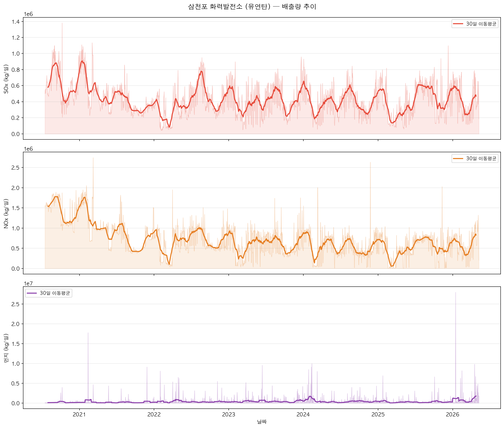
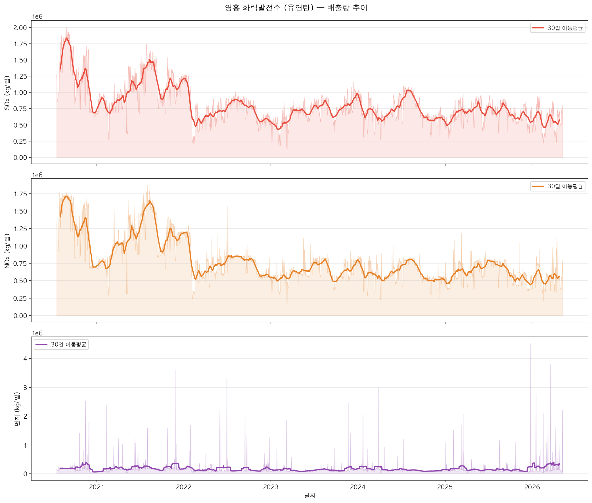
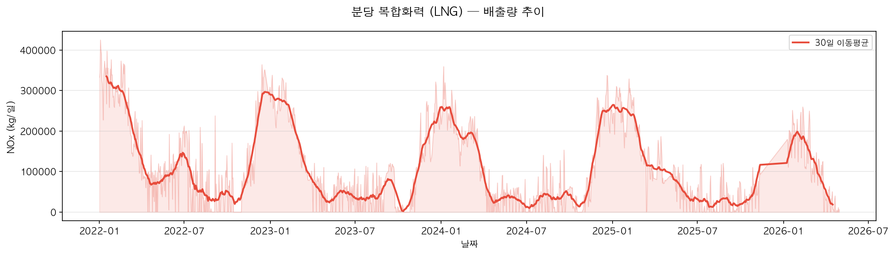
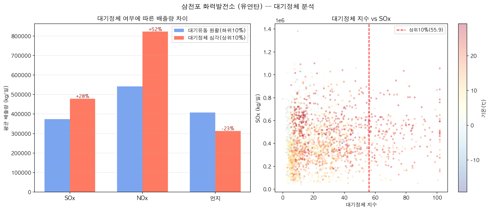
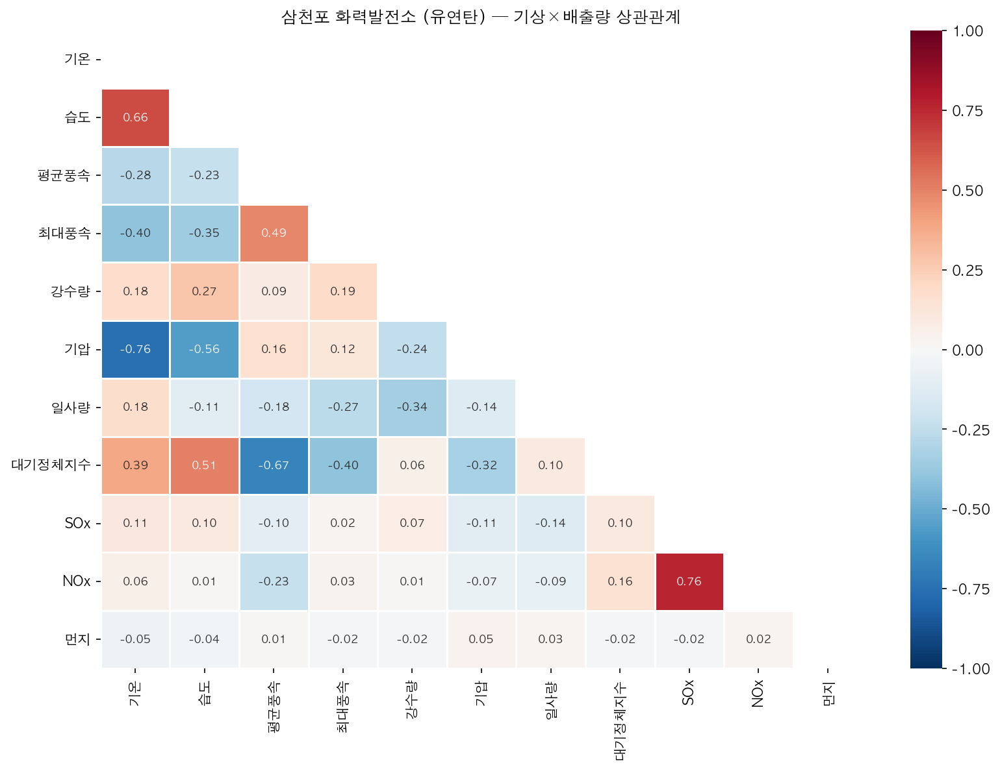
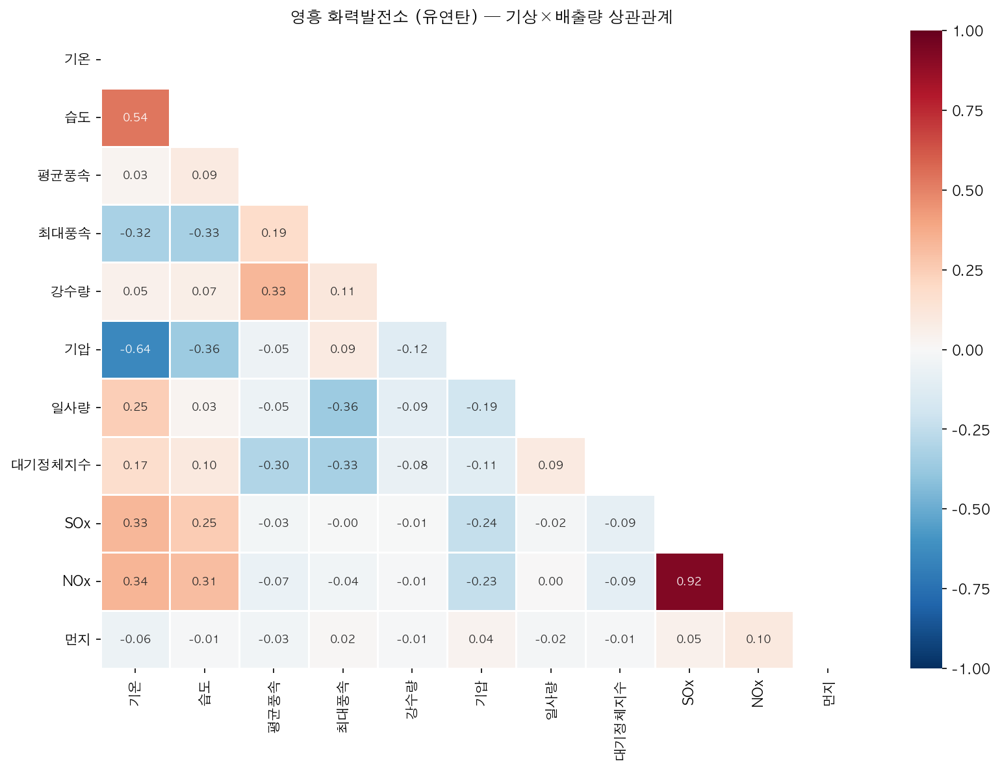
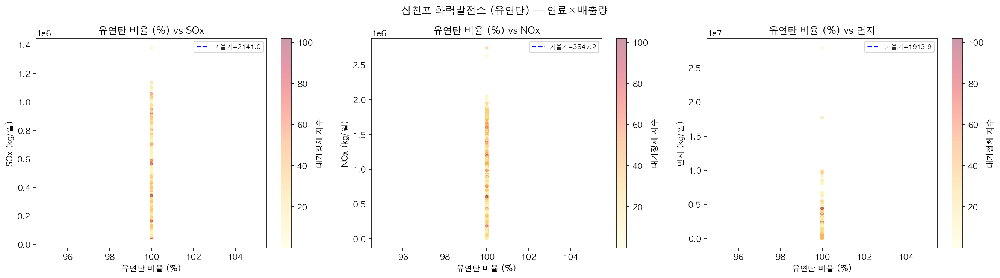

# Ⅱ. 분석 환경 및 데이터

---

## 1. 분석 환경

| 항목 | 내용 |
|------|------|
| 언어 | Python 3.10 |
| 핵심 라이브러리 | XGBoost 1.7.3 · scikit-learn 1.7.2 · SHAP 0.49.1 · pandas · numpy · matplotlib |
| 모델 구조 | 사업소별 독립 XGBoost MultiOutput 모델 (5개 사업소) |
| 재현성 | `xgboost==1.7.3` 버전 고정, 시드 42 고정 → 서버 교체 후에도 동일 결과 보장 |

---

## 2. 데이터 수집 및 전처리

### 2.1 데이터 출처

| 데이터 | 출처 사이트 | URL / 경로 |
|--------|-----------|-----------|
| 대기오염물질 배출농도(일평균) | 한국남동발전 경영공시 | koenergy.kr → 환경/안전 → 대기오염물질 배출실적 |
| 발전실적(이용률·열효율, 월) | 한국남동발전 경영공시 | koenergy.kr → 경영정보 → 발전실적 |
| 연료소비실적(월) | 한국남동발전 경영공시 | koenergy.kr → 경영정보 → 연료사용실적 |
| 기상정보(일평균) | 한국남동발전 경영공시 | koenergy.kr → 환경/안전 |
| 신재생 발전량(시간) | 한국남동발전 경영공시 | koenergy.kr → 경영정보 |
| 시간별 화력발전량 API | 공공데이터포털 | data.go.kr (서비스ID: B551893) |
| 기상 보완 | Open-Meteo 공개 API | open-meteo.com — **JMA Seamless (Japan MSM)** 모델, 5km 격자, 무료·키 불필요 |
| 배출부과금 단가 | 환경부 법령 | 「대기환경보전법 시행령」 [별표 4], law.go.kr |

### 2.2 데이터 수집 흐름

```
[koenergy.kr — 한국남동발전 경영공시]
  배출농도(일평균) ─────────────────────────┐
  기상정보(일평균) ─────────────────────────┤
  연료소비실적(월) ──────────────────────────┤
  발전실적(이용률·열효율, 월) ────────────────┤
  신재생 발전량(시간) ─────────────────────── ├──▶ 전처리 파이프라인 ──▶ master_{plant}.csv
                                              │
[data.go.kr API — 서비스ID: B551893]          │
  삼천포·영흥 일별 발전량 ─────────────────────┤
                                              │
[open-meteo.com 공개 API]                     │
  기상 보완 (삼천포·영흥·분당·영동·여수) ─────────┘
```

### 2.2 전처리 상세

| 단계 | 내용 | 처리 방식 |
|------|------|-----------|
| 배출량 환산 | 농도×유량→일 배출량(kg/일) | `농도 × 유량 × 1440 ÷ 1,000,000` |
| 연료소비 월→일 | 월 소비량을 해당 월 일수로 균등 배분 | `÷ days_in_month` |
| 발전실적 월→일 | 이용률·열효율을 발전량 기중 가중평균 후 배분 | `groupby+mean` → 일 단위 확장 |
| 신재생 시간→일 | 시간별 발전량 일 합산 | `resample('D').sum()` |
| 발전량 통합 | API 발전량 우선, 결측 시 발전실적으로 보완 | `api_gen_mwh.fillna(gen_mwh)` |
| 기상 보완 | 공공데이터 기상 우선, 결측 시 Open-Meteo | inner join 후 NaN → Open-Meteo 대체 |
| 대기정체지수 | 습도·역풍지수·고기압 유무 복합 | `humidity × (1-wind_norm) × pressure_factor` |

### 2.3 파생 피처

| 피처 | 정의 | 의미 |
|------|------|------|
| `wind_sin`, `wind_cos` | 풍향을 360° → sin/cos 변환 | 풍향의 순환성(cyclic) 보존 |
| `stagnation_idx` | 습도×역풍×기압 복합 지수 | 오염물질 확산 억제 강도 |
| `gen_mwh_combined` | API 발전량 우선, 결측→발전실적 | 신뢰성 높은 일 발전량 |
| `SOx_lag1`, `NOx_lag1` | 전일 배출량 | 배출 시계열 자기상관 반영 |
| `SOx_lag7`, `NOx_lag7` | 7일 전 배출량 | 주간 주기성 반영 |
| `seasonal_mgmt` | 12~3월 = 1, 그 외 = 0 | 계절관리제 기간 구분 |
| `year_trend` | 분석 시작일로부터 경과 일수 | 설비 개선·배출규제 연도별 트렌드 |
| `coal_ratio` | 유연탄/(유연탄+LNG+유류) | 연료 믹스 비율 |

---

## 3. 사업소별 데이터 현황

### 3.1 배출량 기초 통계 (학습 데이터 기준)

| 사업소 | 항목 | 평균 (kg/일) | 최솟값 | 최댓값 | 비고 |
|--------|------|------------|--------|--------|------|
| 삼천포 | SOx | 7,700 | 1,200 | 28,500 | — |
| 삼천포 | NOx | 10,400 | 3,100 | 26,000 | — |
| 삼천포 | 먼지 | 7,200 | 80 | 1,652,000 | EP 이벤트 이상치 |
| 영흥   | SOx | 13,100 | 2,800 | 38,000 | — |
| 영흥   | NOx | 12,800 | 4,100 | 31,000 | — |
| 영흥   | 먼지 | 2,100 | 10 | 280,000 | EP 이벤트 이상치 |
| 분당   | NOx | 1,370 | 120 | 4,200 | LNG 복합, SOx≈0 |
| 영동(400MW) | SOx | 64 | 0 | 8,507 | 국내탄+바이오매스 혼소, SOx 삼천포 대비 1% 수준 |
| 영동(400MW) | NOx | 2,293 | 0 | 15,100 | — |
| 영동(400MW) | 먼지 | 196 | 0 | 3,134 | — |
| 여수(680MW) | SOx | 499 | 0 | 22,305 | 유연탄+중유 혼소 |
| 여수(680MW) | NOx | 2,854 | 0 | 51,402 | — |
| 여수(680MW) | 먼지 | 485 | 0 | 27,089 | — |

### 3.2 EDA 주요 발견

**시계열 트렌드**

- 삼천포·영흥 SOx는 2022년 이후 하향 안정화 추세 (연도별 규제 강화 효과)
- 분당 NOx는 계절 변동폭이 크며 12~3월 피크 (난방 수요 연동)







**대기정체와 배출 관계**

- 대기정체지수 상위 25% 구간에서 삼천포 NOx 중위값 +12~15% 상승
- 영흥 먼지는 대기정체지수 상관계수 r=0.38로 가장 높은 민감도 기록



**연료·발전량 피처**

- 발전량(gen_mwh_combined)과 SOx·NOx 간 Pearson r = 0.6~0.8 (강한 양의 상관)
- 유연탄 투입량(유연탄)은 석탄 사업소 SOx와 r = 0.75~0.85







**먼지 이상치 구조**

- 전체 먼지 분포는 정상 발전 구간(~2,000 kg/일)과 EP 이벤트 구간(>50,000 kg/일)으로 이중 분포
- EP 이벤트 발생 시 먼지 단독 급증, SOx·발전량은 정상 유지 → 시스템 오류 또는 설비 점검으로 판단

---

## 4. 시계열 분할 전략

| 구간 | 비율 | 기간(삼천포 기준) | 행수 |
|------|------|-----------------|------|
| 학습(train) | 80% | 2020.07.16 ~ 2024.05.31 | 1,415행 |
| 검증(val) | 10% | 2024.06.01 ~ 2024.12.31 | 214행 |
| 테스트(test) | 10% | 2025.01.01 ~ 2026.05.09 | 494행 |

- 시간 순서를 유지한 **포지셔널 분할** (미래 데이터 누출 방지)
- 테스트셋은 학습에 전혀 사용하지 않은 미래 구간 (2025년 이후)
