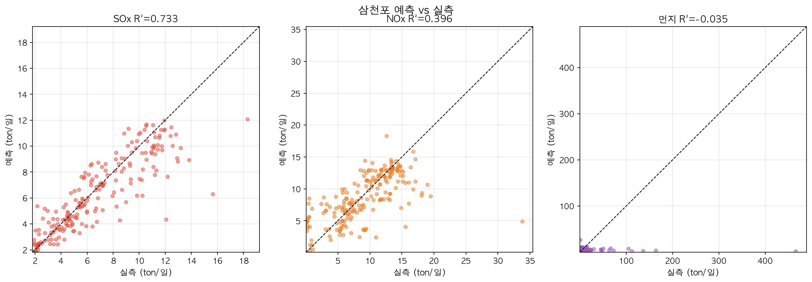
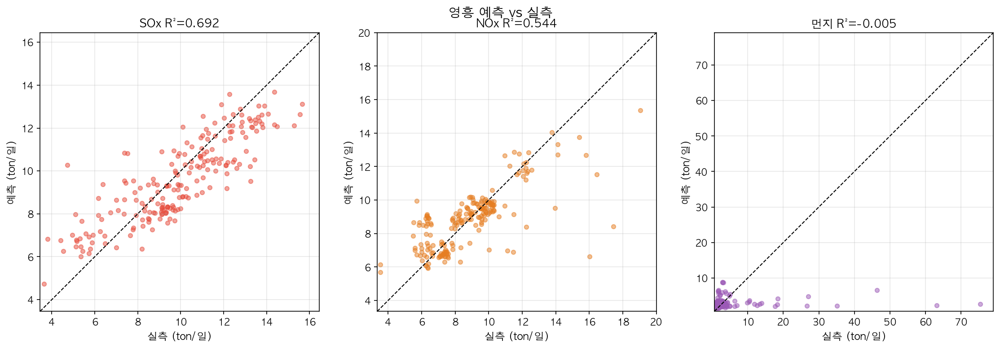
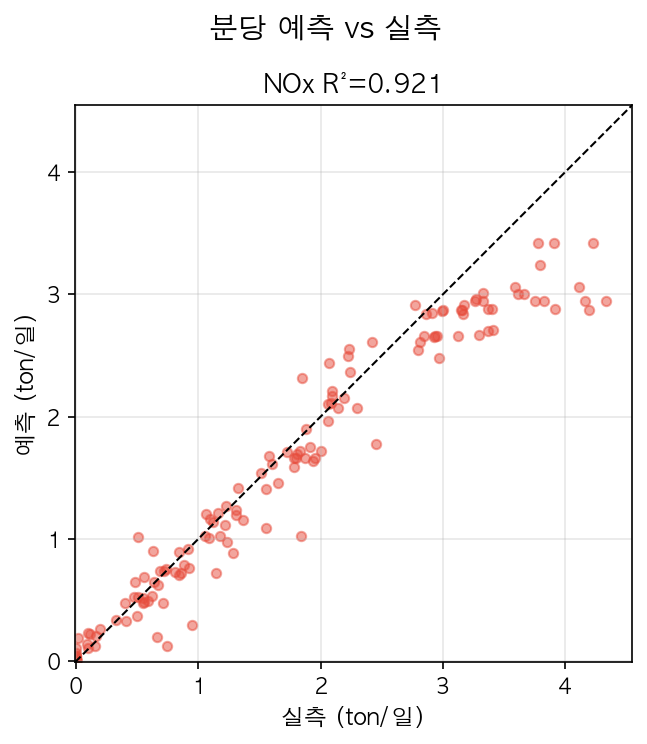
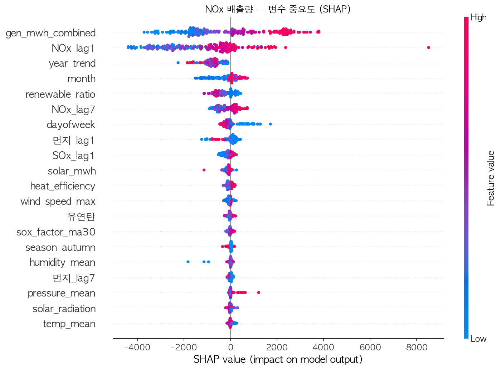
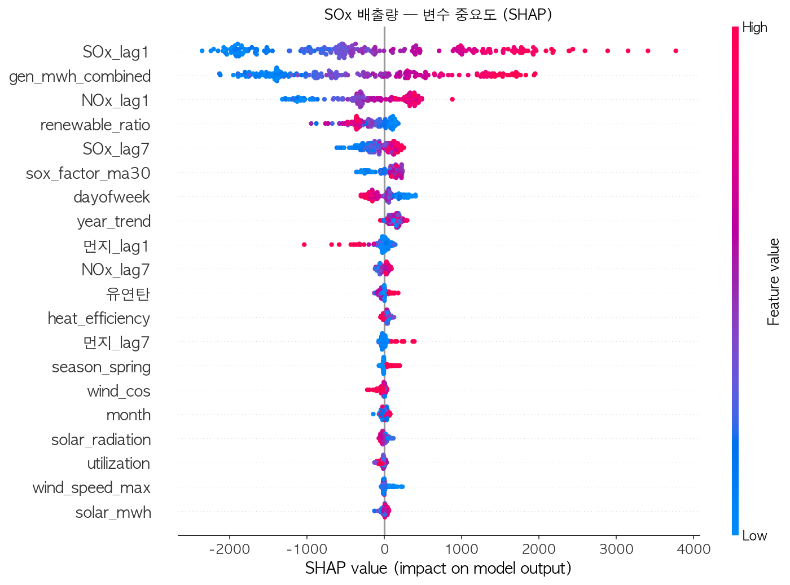
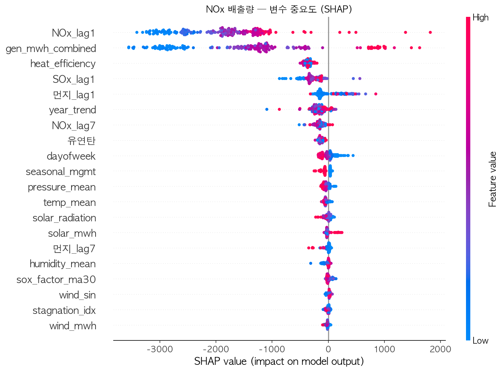
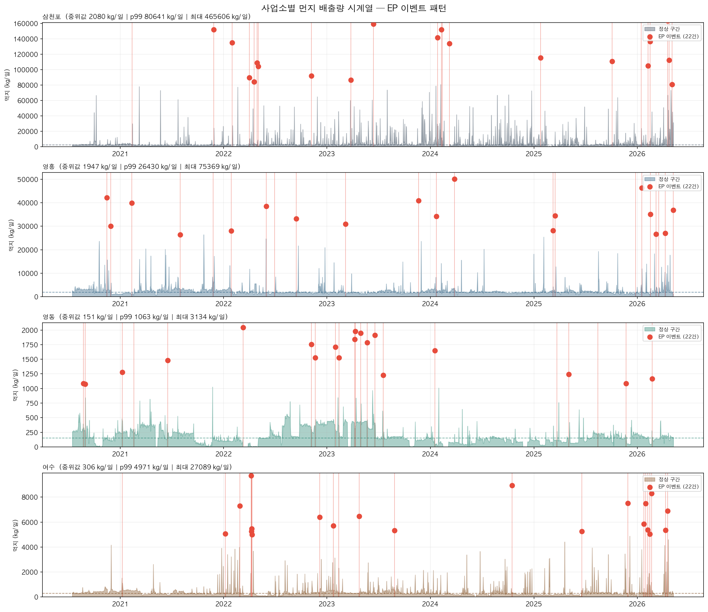
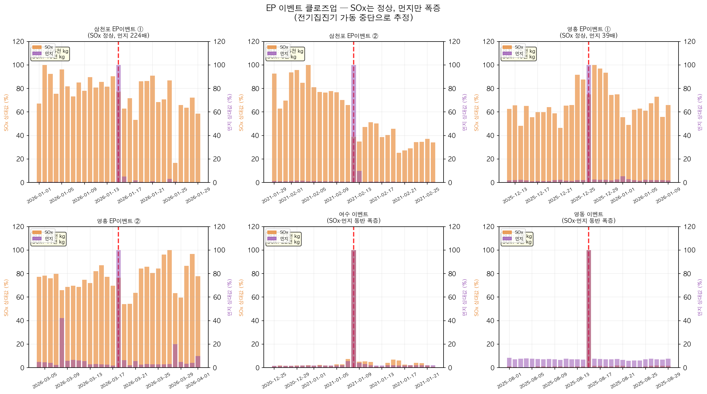
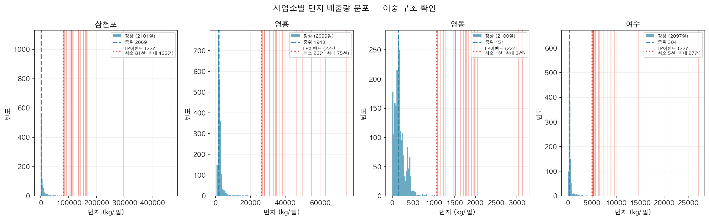

# Ⅲ. 분석 방법 및 모델링

---

## 1. 모델 구조

### 1.1 전체 파이프라인

```
[입력 피처]
  기상 피처(10개): temp_mean, humidity_mean, wind_sin, wind_cos,
                  wind_speed_mean, wind_speed_max, precipitation,
                  pressure_mean, solar_radiation, stagnation_idx
  발전 피처(3개): gen_mwh_combined, utilization, heat_efficiency
  연료 피처(1개): 유연탄 (석탄사업소만)
  시계열 피처(5개): SOx_lag1, SOx_lag7, NOx_lag1, NOx_lag7, 먼지_lag7
  시간 피처(2개): year_trend, seasonal_mgmt
        │
        ▼
  [XGBoost MultiOutputRegressor]
   └─ 사업소별 독립 모델 (5개)
   └─ 분당: SOx/먼지 제외, NOx 단독 예측
        │
        ▼
[출력 타겟]
  SOx (kg/일) · NOx (kg/일) · 먼지 (kg/일)
  [분당: NOx만]
```

### 1.2 XGBoost 주요 하이퍼파라미터

| 파라미터 | 값 | 설명 |
|----------|-----|------|
| `n_estimators` | 500 | 부스팅 라운드 수 |
| `max_depth` | 6 | 트리 깊이 상한 |
| `learning_rate` | 0.05 | 학습률 |
| `subsample` | 0.8 | 행 샘플링 비율 |
| `colsample_bytree` | 0.8 | 열 샘플링 비율 |
| `random_state` | 42 | 재현성 고정 |
| `xgboost 버전` | **1.7.3** | 크로스 서버 재현성 보장 |

### 1.3 사업소별 피처 차이

| 사업소 | 유연탄 피처 | coal_ratio | 대상 타겟 |
|--------|-----------|-----------|-----------|
| 삼천포 | ✓ | ✓ | SOx, NOx, 먼지 |
| 영흥   | ✓ | ✓ | SOx, NOx, 먼지 |
| 분당   | ✗ (LNG) | ✗ | NOx 만 |
| 영동   | ✗ (바이오매스 혼소, coal_ratio≈0) | ✗ | SOx, NOx, 먼지 |
| 여수   | ✓ | ✓ | SOx, NOx, 먼지 |

---

## 2. 모델 성능 (테스트셋)

### 2.1 성능 수치 전체

| 사업소 | 타겟 | R² | RMSE (kg/일) | MAE (kg/일) | 상대오차(RMSE/평균) |
|--------|------|-----|------------|-----------|----------------|
| 삼천포 | SOx | **0.733** | 1,731 | 1,151 | 22% |
| 삼천포 | NOx | 0.396 | 3,830 | 2,534 | 37% |
| 삼천포 | 먼지 | -0.035 | 38,548 | 9,760 | 535% ※EP |
| 영흥 | SOx | **0.692** | 1,427 | 1,164 | 11% |
| 영흥 | NOx | **0.545** | 1,622 | 1,026 | **13%** |
| 영흥 | 먼지 | -0.006 | 8,427 | 2,768 | 401% ※EP |
| 분당 | NOx | **0.921** | 360 | 233 | 26% |
| 영동 | SOx | 0.147 | 103 | 36 | 160% |
| 영동 | NOx | 0.415 | 718 | 485 | 31% |
| 영동 | 먼지 | 0.098 | 111 | 47 | 57% |
| 여수 | SOx | 0.468 | 534 | 329 | 107% |
| 여수 | NOx | **0.753** | 364 | 221 | **13%** |
| 여수 | 먼지 | 0.136 | 1,305 | 499 | 269% |

> ※EP: 전기집진기 이벤트로 인한 이상치가 RMSE를 비정상적으로 키움 — R² 및 상대오차 모두 신뢰 불가







### 2.2 성능 해석

**SOx (삼천포·영흥)**
- R²=0.69~0.73, 상대오차 11~22% → 실용 수준
- 발전량·유연탄 투입량과 강한 상관, lag 피처가 시계열 연속성 포착

**NOx**
- **분당 R²=0.921, 상대오차 26%**: LNG 연소 NOx는 발전량·기온 피처만으로 거의 설명 가능
- **영흥 R²=0.545이지만 상대오차 13%**: R²만 보면 낮아 보이나 실제 오차는 평균의 13% 수준 → 감발 효과 추정에 충분
- **삼천포 NOx 상대오차 37%**: 연소 온도·공기비·SCR 운전 등 미확보 변수 영향, 방향성 판단 용도로 활용
- **여수 NOx R²=0.753, 상대오차 13%**: 양호

**영동·여수 SOx**
- 영동 SOx: 평균 64 kg/일에 RMSE 103 kg/일 → 오차가 실제값보다 큼, 실용 불가
- 여수 SOx: 상대오차 107%, 정책 활용 시 주의 필요

**먼지 (R²<0, 상대오차 400~535%)**
- 삼천포·영흥 먼지 R²가 음수인 근본 원인: **전기집진기(EP) 가동 중단 이벤트**
- EP 이벤트 발생 시 먼지 하루 만에 중위값의 **39~224배** 폭증
- SOx·발전량은 정상 유지 → 피처로 이벤트 예측 불가, EP 운전 상태 데이터 미확보가 구조적 한계
- **모델 한계로 명시하되, SOx·NOx 예측을 통한 최적화에 집중**

---

## 3. SHAP 피처 중요도

### 3.1 삼천포 NOx

| 순위 | 피처 | 피처 정의 | 방향성 |
|------|------|-----------|--------|
| 1 | `gen_mwh_combined` | 일 발전량(MWh) — API 실측 우선, 결측 시 발전실적으로 보완 | + (발전량 증가 → 연료 투입 증가 → NOx 증가) |
| 2 | `NOx_lag1` | 전일(t-1) NOx 배출량(kg/일) | + (전일 배출 높으면 당일도 유사 운전 조건 지속) |
| 3 | `year_trend` | 분석 시작일로부터 경과 일수 (장기 트렌드 반영) | − (연도 증가 → 설비 개선·규제 강화로 NOx 감소) |
| 4 | `utilization` | 발전 설비 이용률(%) — 발전량 ÷ 설비용량 | + (이용률 상승 → 고부하 연소 → NOx 증가) |
| 5 | `temp_mean` | 일 평균 기온(℃) | 비선형 (고온 시 열NOx 생성 증가, 저온 시 연소 효율 변화) |





### 3.2 영흥 NOx

| 순위 | 피처 | 피처 정의 | 방향성 |
|------|------|-----------|--------|
| 1 | `gen_mwh_combined` | 일 발전량(MWh) | + (삼천포와 동일 메커니즘) |
| 2 | `NOx_lag1` | 전일 NOx 배출량(kg/일) | + |
| 3 | `year_trend` | 분석 시작일로부터 경과 일수 | − |
| 4 | `유연탄` | 월 유연탄 소비량(톤)을 일 균등 배분한 값 | + (석탄 투입량 증가 → 고온 연소 → NOx 증가) |
| 5 | `utilization` | 발전 설비 이용률(%) | + |

- 영흥은 설비용량(5,080 MW)이 크고 유연탄 절대 투입량이 많아 `유연탄` 피처 중요도가 삼천포보다 높게 나타남



### 3.3 분당 NOx (R²=0.921)

| 순위 | 피처 | 피처 정의 | 방향성 |
|------|------|-----------|--------|
| 1 | `gen_mwh_combined` | 일 발전량(MWh) | + (LNG 발전량이 NOx 배출량을 거의 1:1로 결정) |
| 2 | `temp_mean` | 일 평균 기온(℃) | + (고온 → 연소 공기 내 열NOx 생성 증가) |
| 3 | `seasonal_mgmt` | 계절관리제 기간 여부 (12~3월=1, 그 외=0) | − (계절관리제 기간 이용률 상한으로 발전량 제한) |

- lag 피처 중요도 낮음: LNG 연소 NOx는 전일 배출과의 자기상관이 석탄 대비 약함 — 당일 발전량으로 거의 설명 가능

---

## 4. 먼지 모델 한계 — EP 이벤트 상세

### 4.1 전기집진기(EP)란?

**전기집진기(Electrostatic Precipitator, EP)**는 석탄 연소 후 발생하는 먼지(비산재)를 고압 전기장으로 포집하는 방지 설비다. 발전소에서 배출되는 먼지의 99% 이상을 제거하며, 정상 운전 시 먼지 배출을 수십~수백 kg/일 수준으로 억제한다.

**EP 이벤트**란 EP의 전원 차단·절연 불량·극판 단락 등 설비 장애로 EP가 일시적으로 기능을 상실하는 상황을 말한다. 이 경우 연소 가스 내 먼지가 여과 없이 연돌로 방출되어 하루 만에 수만~수백만 kg의 먼지가 배출된다.

```
정상 운전 기간          EP 이벤트 발생
먼지  ~2,000 kg/일  →  최대 1,650,000 kg/일 (삼천포, 정상 대비 약 224배)
SOx   정상            →  정상 (EP는 먼지 전용 — SOx 영향 없음)
발전량 정상           →  정상 (발전소는 계속 가동 중)
```







### 4.2 모델이 예측할 수 없는 이유

| 요인 | 설명 |
|------|------|
| 피처와 독립적 | EP 장애는 발전량·기상·연료 변수와 무관하게 발생 |
| 이벤트 빈도 낮음 | 학습 데이터 내 EP 이벤트 비율 < 1% → 모델이 패턴 학습 불가 |
| 극단적 스케일 | 정상값과 이벤트값의 차이가 100~200배 → RMSE·R² 모두 왜곡 |
| 운전 상태 데이터 미확보 | EP 가동 여부, 전압·전류 등 설비 상태값이 현행 데이터셋에 없음 |

**결론**: 먼지 R²<0, 상대오차 400~535%는 모델 알고리즘 문제가 아닌 **데이터 구조적 한계**다. SOx·NOx 예측 기반 최적화에 집중하고, 먼지 예측은 EP 운전 이력 데이터 확보 후 재도전한다.

### 4.3 EP 운전 이력 활용 개선 방향

EP 운전 이력 데이터가 확보되면 다음 3단계 개선이 가능하다.

**단계 1 — EP 상태 피처 추가 (즉시 효과)**
- `ep_status`: EP 정상(1) / 부분가동(0.5) / 정지(0) 일별 레이블
- `ep_voltage_mean`: EP 1차 전압 일 평균 (kV) — 전압 강하가 포집 효율 저하의 선행 지표
- `ep_current_mean`: EP 1차 전류 일 평균 — 전류 이상으로 극판 단락 징후 탐지 가능

**단계 2 — 이상치 구간 분리 모델링**
- EP 정상 구간 데이터만으로 먼지 회귀 모델 재학습 → 정상 운전 시 R² 대폭 개선 기대
- EP 이상 구간은 별도 **이진 분류기**로 탐지 (정상/이벤트 판별)
- 최종 예측: 분류기가 "이벤트" 판정 시 별도 이벤트 배출 추정값 사용

**단계 3 — 예측 기반 선제 대응**
- EP 전압·전류 트렌드 이상 감지 → 점검 일정 사전 조정
- EP 장애 예보일에는 감발 대신 정비 우선 지시 → 배출 방지 근본 해결
