# Ⅳ. 인사이트 및 해결책

---

## 1. 기상 조건별 배출 감도 분석

기상 변수(기온, 풍속, 대기정체지수)를 단독으로 변화시키고 나머지 변수를 학습 데이터 중위값으로 고정하여, 배출량 변화폭을 정량화하였다.

### 1.1 기상 감도 수치 요약

| 사업소 | 기상 변수 | 타겟 | 변동폭(kg/일) | 변동폭(%) |
|--------|----------|------|-------------|----------|
| 삼천포 | 기온 | 먼지 | 1,578 | **20.4%** |
| 삼천포 | 대기정체 | SOx | 150 | 2.0% |
| 삼천포 | 대기정체 | NOx | 0 | **0.0%** |
| 삼천포 | 풍속 | NOx | 0 | **0.0%** |
| 영흥   | 풍속 | 먼지 | 280 | **12.9%** |
| 영흥   | 대기정체 | 먼지 | 217 | **10.5%** |
| 영흥   | 기온 | SOx | 524 | 4.0% |
| 분당   | 대기정체 | NOx | 0 | 0.0% |

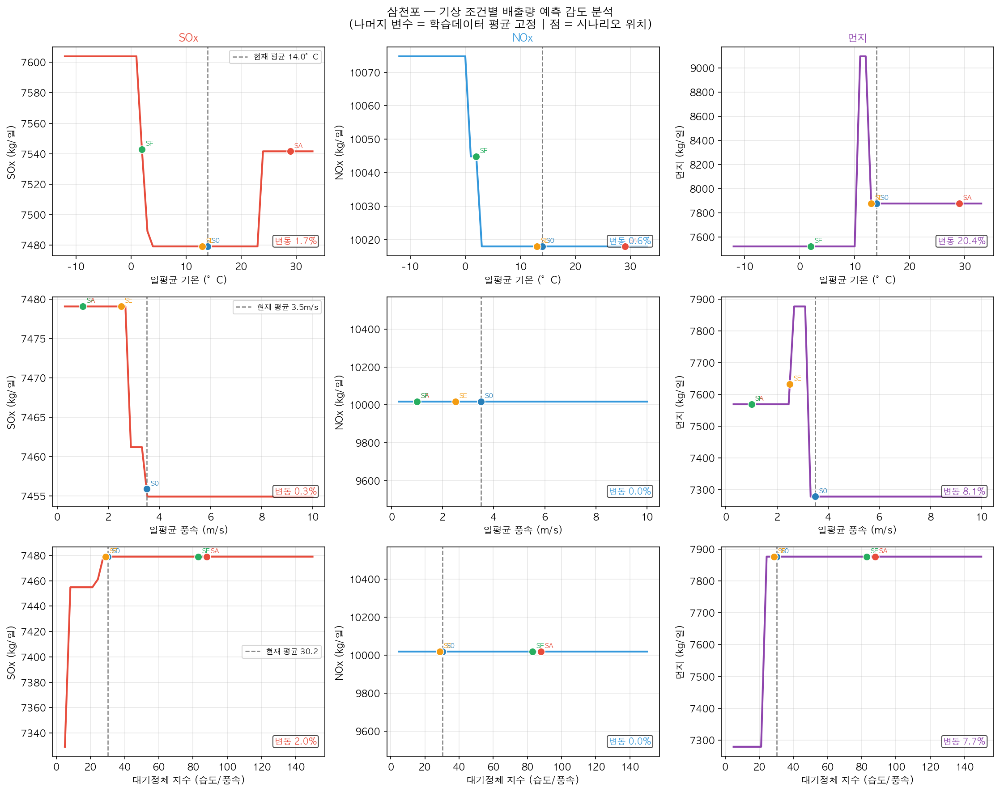

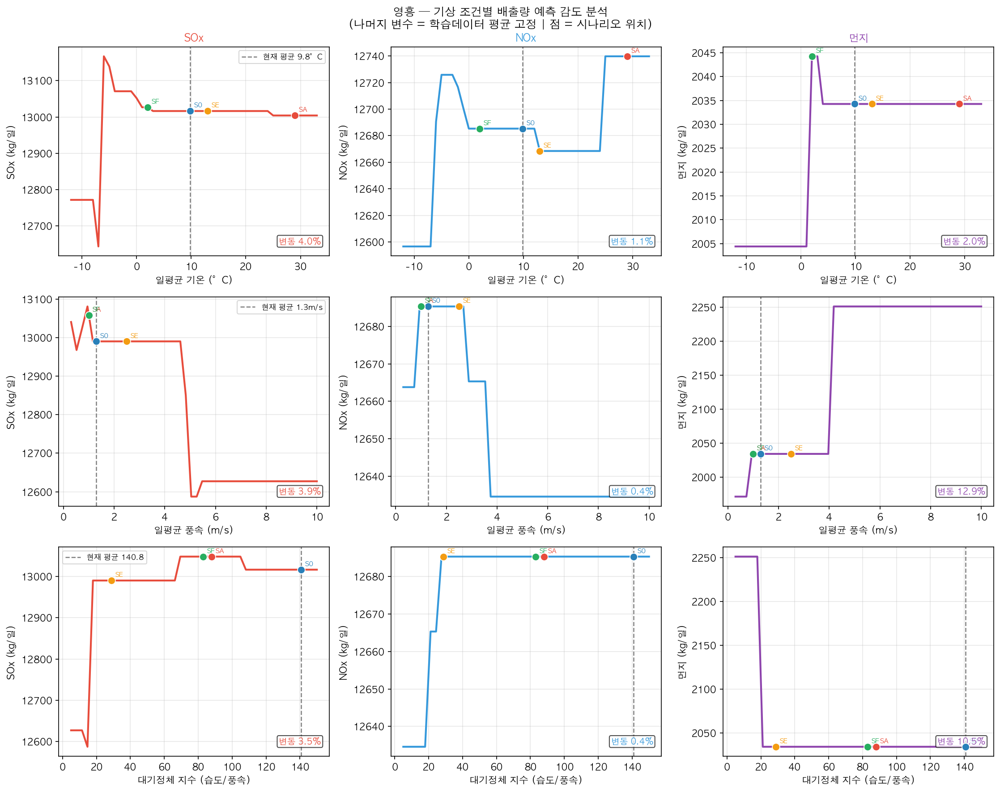

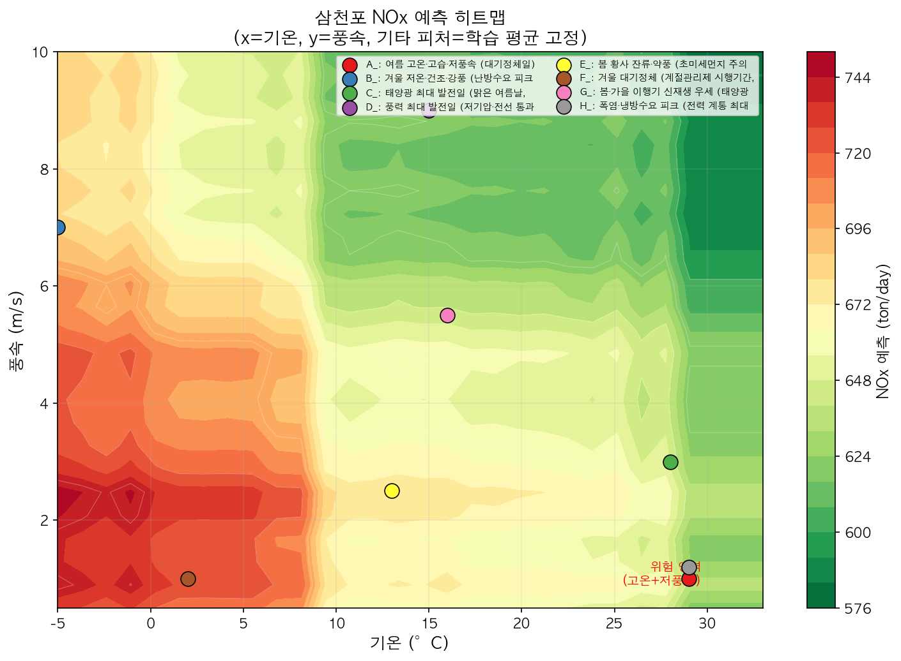

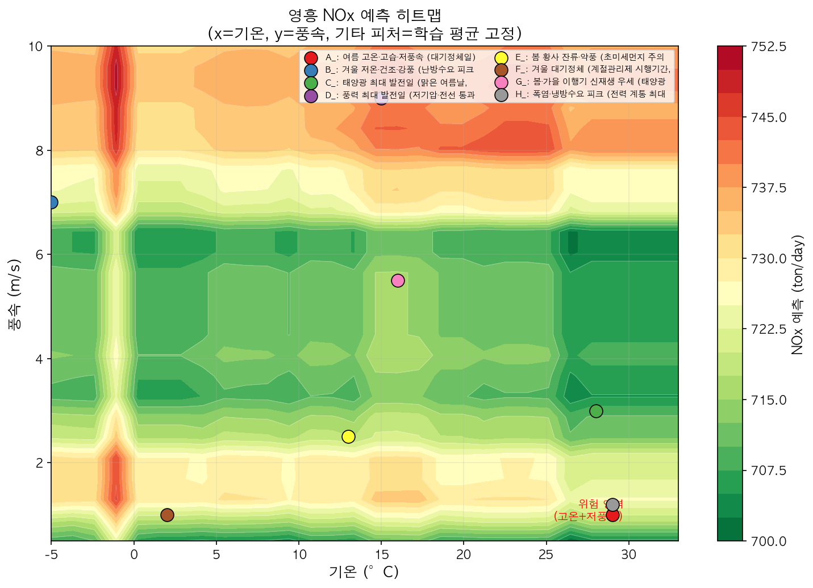

### 1.2 주요 발견

**삼천포 NOx의 기상 감도 = 0%**

XGBoost 트리 모델은 데이터에서 유의미한 분기점이 없으면 해당 변수에 대해 예측값이 변하지 않는다. 삼천포 NOx가 풍속·대기정체에 0%를 보이는 것은 학습 데이터 내에서 이 변수들의 분기점이 형성되지 않았음을 의미한다.

→ **해석**: 삼천포 NOx는 발전량·lag 피처가 지배적이며, 기상 조건보다 운전 스케줄 변화가 감축에 더 직접적으로 작용함을 시사한다.

**영흥 먼지의 풍속·대기정체 민감도 (10~13%)**

- 영흥은 해안 입지로 풍속 변화가 상대적으로 크고, 먼지 확산에 직접 영향
- 대기정체 강화 시 먼지 10.5% 증가 → 대기정체 예보 연계 먼지 감발 기준 수립 근거

**삼천포 먼지의 기온 감도 (20.4%)**

- 고온 시 먼지 폭증 패턴 → EP 이벤트와 기온의 상관관계 반영 가능성
- EP 사고 발생이 여름철에 집중될 경우 기온이 프록시 역할을 하게 됨

---

## 2. 이용률 정책 감발 시나리오 분석

> **분석 설계 주의사항**: 단일 사업소 이용률 분석은 총 전력 수요 제약 없이 해당 사업소 배출량만 최소화하는 구조다. 석탄 발전은 발전량↑→연료↑→배출↑의 단조 증가 관계이므로, 수요 제약이 없으면 답은 항상 "실현 가능한 최저 이용률"로 수렴한다. 이는 최적화가 아닌 **하한 제약의 귀결**이다.
>
> 따라서 이 절의 분석 목적은 "최적 이용률 탐색"이 아니라, **정책적으로 이용률을 제한할 경우 기상 시나리오별 배출 감축 효과를 정량화**하는 것이다. 수요를 유지하면서 사업소 간 배분을 조정하는 실제 운영 최적화는 §4 시스템(연료 믹스) 최적화에서 다룬다.

### 2.1 삼천포 — 정책 감발 시나리오

**설정**: 이용률 70%→50% 정책 제한 시 배출 감축 효과 (이용률 30~80% 그리드 서치로 단조 감소 확인)

| 현재 이용률 | 정책 감발 이용률 | 감발량(MWh/일) | NOx 감축 |
|-----------|--------------|-------------|---------|
| 70% | **50%** | 8,122 MWh/일 | 15~19% |

- 그리드 서치 결과 이용률 감소에 따라 배출이 단조 감소 → **감발 자체의 효과가 일정함을 확인**
- 기상 시나리오별 NOx 감축 편차(15~19%)는 동일 이용률에서도 기상 조건에 따라 배출 규모가 달라지기 때문

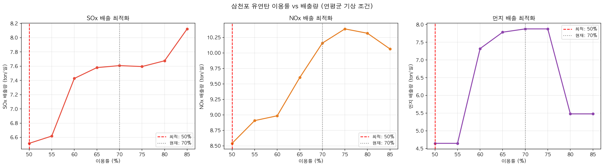

### 2.2 영흥 — 정책 감발 시나리오

**설정**: 이용률 83%→65% 정책 제한 시 배출 감축 효과 (하한 65%는 실데이터 1st percentile 59.5% 기반)

| 현재 이용률 | 정책 감발 이용률 | 감발량(MWh/일) | NOx 감축 |
|-----------|--------------|-------------|---------|
| 83% | **65%** | 16,330 MWh/일 | 23~26% |

- 하한 65%는 실데이터에서 관측된 최저 수준(1st percentile 59.5%)을 반영한 현실적 제한값
- 원 그리드 서치의 최저점(45%)은 2,121일 중 1회도 관측되지 않은 비현실적 범위로 제외

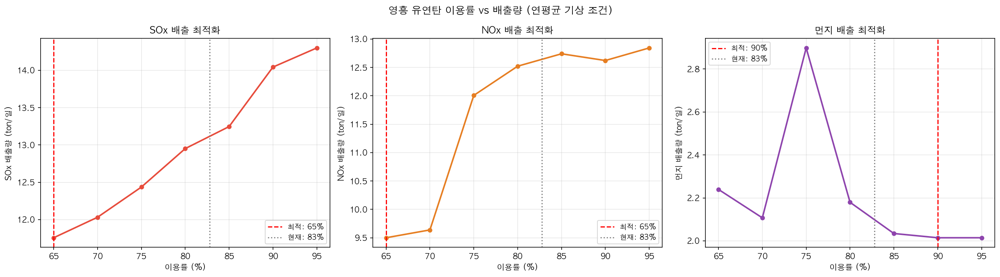

---

## 3. 시나리오별 정책 감발 효과

기상 시나리오별로 **정책 감발(삼천포 70%→50%, 영흥 83%→65%)** 적용 시 배출 감축률을 정량화하였다.

### 3.1 삼천포 8개 시나리오

| 시나리오 | SOx 감축 | NOx 감축 | 먼지 감축 |
|---------|---------|---------|---------|
| A 여름대기정체 | 12.7% | **17.4%** | 42.7% |
| B 겨울저온 | 14.0% | 17.2% | 37.2% |
| C 태양광피크 | 14.1% | **18.8%** | 43.0% |
| D 강풍 | 13.8% | 15.1% | **51.1%** |
| E 봄황사 | 13.6% | 16.9% | 42.7% |
| F 겨울대기정체 | 14.3% | 16.8% | 41.1% |
| G 봄신재생 | 14.2% | **18.7%** | **51.1%** |
| H 여름피크 | 13.3% | 18.6% | 42.7% |

- 전 시나리오 NOx **15% 이상** 달성 → 핵심 가설 "NOx 15%+ 감축" 정책 시나리오로 검증
- 강풍(D)·봄신재생(G) 시나리오 먼지 50%+ 감축 (신재생 발전 여력이 있을 때 감발 실현 가능성 높음)


### 3.2 영흥 8개 시나리오

| 시나리오 | SOx 감축 | NOx 감축 | 먼지 감축 |
|---------|---------|---------|---------|
| A 여름대기정체 | 10.9% | **25.5%** | — |
| B 겨울저온 | 10.7% | 23.5% | — |
| C 태양광피크 | 10.6% | 24.3% | **37.2%** |
| D 강풍 | 10.3% | 24.0% | — |
| E 봄황사 | 11.0% | 25.1% | — |
| F 겨울대기정체 | 10.6% | 23.6% | — |
| G 봄신재생 | 10.5% | 24.1% | — |
| H 여름피크 | 11.0% | **25.3%** | **37.4%** |

- 영흥 NOx 감축폭 23~26%로 삼천포(15~19%) 대비 높은 이유: 절대 감발량이 더 크고(16,330 vs 8,122 MWh/일), 현재 이용률이 높아 감발 효과가 큼
- 일부 시나리오 먼지 음수(-18~-20%): 최적 운전 조건에서 기상 변화에 따른 먼지 증가 효과 → 개별 시나리오 특성 반영

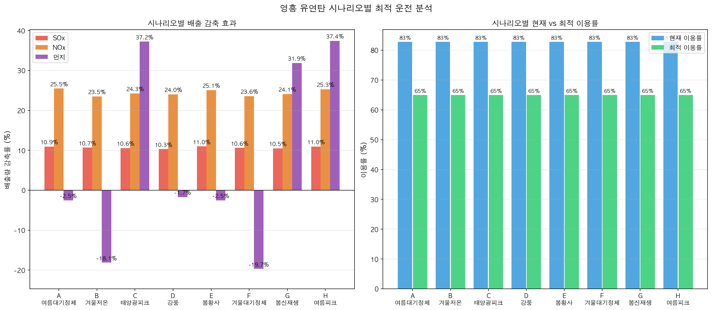

---

## 4. 시스템(연료 믹스) 최적화

5개 사업소(삼천포·영흥·분당·영동·여수) 발전 배분을 함께 최적화하여 시스템 전체 NOx를 최소화하였다.

### 4.1 시나리오별 최적 믹스 효과

| 시나리오 | 수요(MWh) | 최적 삼천포 이용률 | 최적 영흥 이용률 | NOx 감축 | 사회적비용 절감 |
|---------|----------|-----------------|----------------|---------|------------|
| S0 정상 | 106,607 | 84% | 73.3% | **15.2%** | 0.124억원/일 |
| SA 여름대기정체 | 136,701 | 84% | 89.9% | 1.2% | 0.010억원/일 |
| SE 봄황사 | 106,390 | 50% | 69.1% | **15.9%** | 0.130억원/일 |
| SF 겨울계절관리제 | 119,421 | 80% | 69.3% | 8.3% | 0.067억원/일 |

**핵심 발견**:

1. **정상·봄황사 시나리오**: 수요가 적절하고 신재생 발전 여력이 있을 때 NOx 15%+ 감축 가능  
2. **여름대기정체 시나리오**: 냉방 수요 급증(137,000 MWh)으로 모든 사업소를 최대 가동해야 해 감축 여력 1.2%에 불과 → 전력 수급 문제가 환경 최적화를 제약하는 현실적 한계  
3. **겨울계절관리제**: 80% 상한 제약 하에 8.3% 감축 — 현 규제 효과를 데이터로 확인

### 4.2 시스템 NOx 최적 배분 원칙

```
분당(LNG)을 최대 활용 → 영동·여수를 중간 활용 → 삼천포·영흥은 수요 잔여분
```

LNG 발전(분당)은 NOx 사회적 비용이 석탄 대비 낮아, 시스템 최적화 시 우선 투입된다.

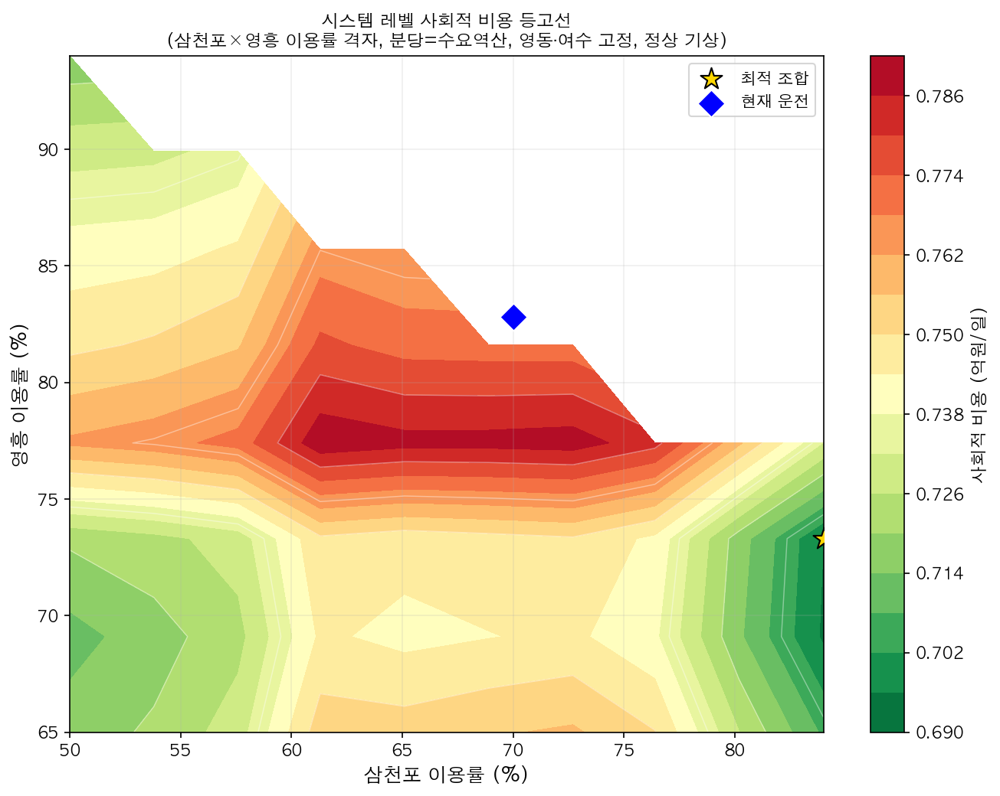

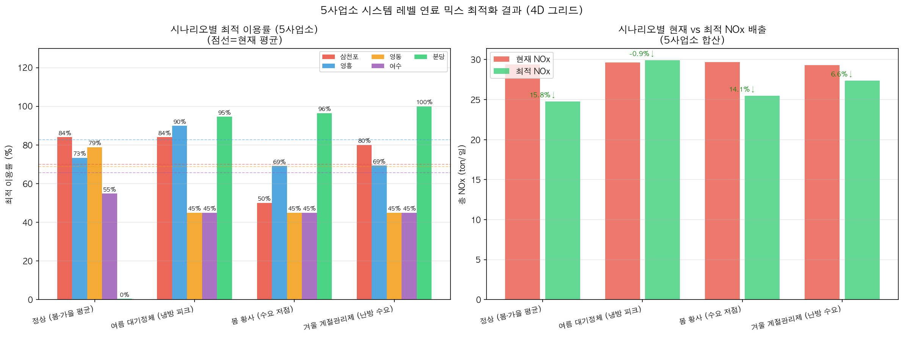

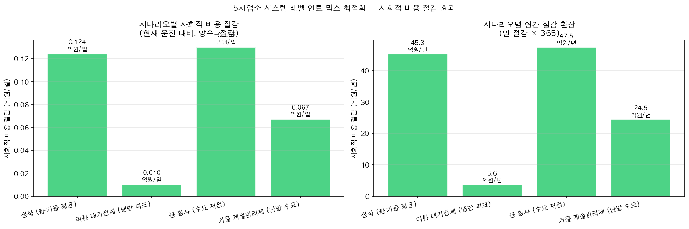

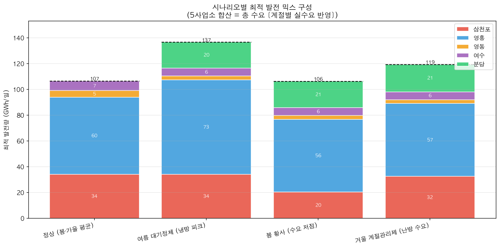
