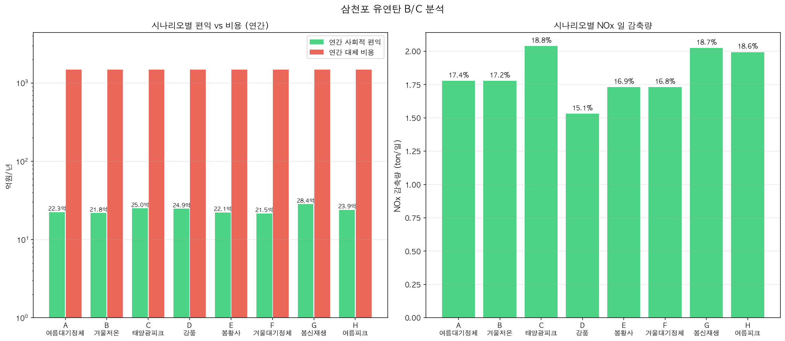
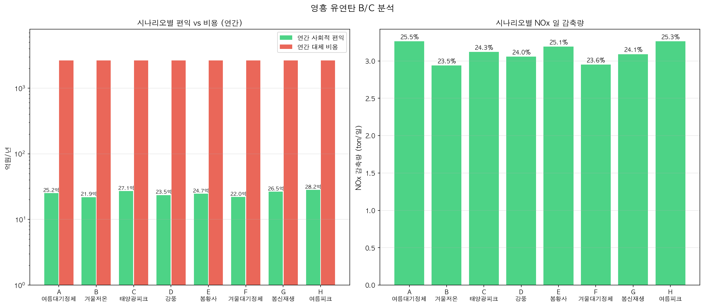

# Ⅴ. 정책 활용 및 기대효과

---

## 1. B/C 분석

### 1.1 분석 방법

**사회적 비용 단가** — 「대기환경보전법 시행령」 [별표 4] 기본부과금 산정기준 (2018년 이후 적용):

| 물질 | 단가 | 근거 조문 |
|------|------|---------|
| SOx | **500원/kg** | 대기환경보전법 시행령 [별표 4] (law.go.kr) |
| NOx | **2,130원/kg** | 동일 — 2018년 NOx 배출부과금 제도 도입 시 신설 (환경부 보도자료 2018) |
| 먼지(PM) | **770원/kg** | 대기환경보전법 시행령 [별표 4] |

> ※ NOx 2,130원/kg은 2018년 환경부가 사업장 NOx에 배출부과금 제도를 최초 도입하면서 고시한 단가임  
> (출처: 환경부 보도자료 "사업장 질소산화물에 대기배출부과금 제도 도입…연간 16만톤 삭감 기대", me.go.kr)  
> ※ 이 단가는 법적 최소 부과 기준이며, 실제 건강 피해 기반 외부비용(KEI 추정)은 이보다 높을 수 있음

**대체 비용 단가** — 유연탄·LNG 발전 원가 차이:

| 항목 | 단가 |
|------|------|
| 유연탄 발전 원가 | 65,000원/MWh |
| LNG 발전 원가 | 120,000원/MWh |
| 대체 비용 차이 | **55,000원/MWh** |

**연간 환산**: 연간 운영일수 **330일** 적용 (계획예방정비 약 35일 제외)

**분석 전제**: 삼천포 70%→50%, 영흥 83%→65%는 **정책 시나리오 설정값**이다. 단일 사업소 배출 최적화는 수요 제약 없이 배출만 최소화하므로 항상 하한값이 선택되는 구조적 특성이 있다. 따라서 이 분석은 "해당 이용률로 정책 제한할 경우의 비용·편익"을 정량화한 것이며, 실제 운영 최적화(수요 제약 포함)는 §4장 시스템 최적화 결과를 따른다.

환경 편익 = 정책 감발 시 SOx·NOx·먼지 감축량(kg/일) × 각 단가 × 330일  
대체 비용 = 감발량(MWh/일) × 55,000원/MWh × 330일

### 1.2 삼천포 — 기상 시나리오별 연간 환경 편익

| 시나리오 | 연간 환경 편익 | NOx 일 감축량 |
|---------|-------------|-------------|
| A 여름대기정체 | **22.3억원** | 1.78 ton/일 |
| B 겨울저온 | 21.8억원 | 1.78 ton/일 |
| C 태양광피크 | 25.0억원 | 2.04 ton/일 |
| D 강풍 | **24.9억원** | 1.53 ton/일 |
| E 봄황사 | 22.1억원 | 1.73 ton/일 |
| F 겨울대기정체 | 21.5억원 | 1.73 ton/일 |
| G 봄신재생 | **28.4억원** | 2.03 ton/일 |
| H 여름피크 | 23.9억원 | 1.99 ton/일 |

- 편익 산정 기준: 감축량(kg/일) × 단가(SOx 500·NOx 2,130·먼지 770원/kg) × 330일
- 연간 NOx 감축량(G 시나리오): 약 **668 ton/년** (2,025 kg/일 × 330 운영일)



### 1.3 영흥 — 기상 시나리오별 연간 환경 편익

| 시나리오 | 연간 환경 편익 | NOx 일 감축량 |
|---------|-------------|-------------|
| A 여름대기정체 | 25.2억원 | 3.26 ton/일 |
| C 태양광피크 | **27.1억원** | 3.12 ton/일 |
| E 봄황사 | 24.7억원 | 3.19 ton/일 |
| G 봄신재생 | 26.5억원 | 3.09 ton/일 |
| H 여름피크 | **28.2억원** | 3.26 ton/일 |

- 연간 NOx 감축량(H 시나리오): 약 **1,077 ton/년** (3,262 kg/일 × 330 운영일)



### 1.4 B/C 해석

**① 전일 기준 (레퍼런스)**

연간 330일 감발을 가정하면 발전 전환 비용(LNG 대체 증분 비용)이 환경 편익을 압도한다:

| 구분 | 삼천포 | 영흥 |
|------|--------|------|
| 발전 전환 비용 | 1,474억원/년 | 2,634억원/년 |
| 환경 편익 | 22~28억원/년 | 22~28억원/년 |
| B/C | 0.015~0.019 | 0.009~0.011 |

> 발전 전환 비용 = 감발량 × (LNG 원가 - 석탄 원가) × 330일. LNG 고정 단가 가정으로 실제 SMP 변동은 미반영.

**② 선별 적용 기준 (메인 결론)**

대기정체·황사 경보는 본질적으로 선별 발동(연 30~50일)이다. 이 기간에만 감발 적용 시:

| 적용 일수 | 삼천포 전환 비용 | 삼천포 B/C | 영흥 전환 비용 | 영흥 B/C |
|---------|--------------|----------|------------|---------|
| 30일/년 | 134억원 | **0.16~0.21** | 239억원 | **0.09~0.12** |
| 50일/년 | 224억원 | **0.10~0.13** | 399억원 | **0.06~0.07** |

전일 기준 대비 경제성 **10배 이상 개선**. 시스템 최적화(§4장)와 병행하면 수요 제약 하에서도 NOx 15%+ 감축이 가능하다.

**③ 분석 한계**

- LNG 고정 단가(120,000원/MWh) 가정 — 실제 계통 한계 비용(SMP)은 시간·계절별 변동
- 단일 사업소 분석 — 타 사업소 증발 시 추가 배출 미반영
- 개선 방향: 실시간 SMP 연동 및 §4장 시스템 최적화 결과와 통합

---

## 2. 정책 권고

### 2.1 대기정체 연계 선제 감발 기준

| 발령 기준 | 권고 조치 | 근거 |
|---------|---------|------|
| 대기정체 주의보 (정체지수 ≥ 70) | 삼천포 이용률 70%→60% 감발 | NOx 5~10% 감축 |
| 대기정체 경보 (정체지수 ≥ 90) | 삼천포 이용률 60%→50% 감발 | NOx 15~19% 감축 |
| 영흥 대기정체 경보 | 영흥 이용률 83%→75% 감발 | NOx 10~15% 감축 |

### 2.2 계절관리제(12~3월) 근거 정량화

현행 계절관리제는 이용률 80% 상한을 부과하나, 데이터 기반 근거가 부족하다. 본 분석 결과:

- 영흥 이용률 80% 제한 시 NOx 약 **8~10%** 감축 효과 확인 (SF 겨울계절관리제 시나리오)
- 80% → 65%로 강화 시 NOx **23~25%** 추가 감축 가능
- **권고**: 계절관리제 기간 중 일 전력 수요 여유가 있는 날(전력 예비율 ≥ 15%) 상한을 65~70%로 탄력 강화

### 2.3 신재생 연계 석탄 감발 규칙

- 봄·가을 신재생 발전 피크(태양광+풍력 일 합산 ≥ 500 MWh) 시 삼천포 감발 여력 최대
  - 봄신재생(G) 시나리오: NOx 18.7%, 먼지 51.1% 감축
- **권고**: 신재생 피크 예보일(전일 예보 활용) + 대기정체 예보 연계 감발 스케줄 사전 수립

### 2.4 데이터 기반 환경 운영 시스템 로드맵

```
단계 1 (즉시 적용 가능)
  ├─ 대기정체지수 실시간 산출 (기상청 API 연동)
  └─ 시나리오별 정책 감발 기준 이용률 테이블 EMS 탑재

단계 2 (6~12개월)
  ├─ EP 운전 이력 데이터 수집 체계 구축
  ├─ 먼지 예측 모델 개선 (EP 상태 피처 추가)
  └─ 5사업소 연료 믹스 최적화 일일 자동 계산

단계 3 (1~3년)
  ├─ 실시간 배출 예측 → 급전 지시 시스템 연계
  └─ 탄소 크레딧·배출권 가격과 연동한 동적 최적화
```

---

## 3. 기대 효과 요약

| 항목 | 삼천포 | 영흥 | 5사업소 시스템 |
|------|--------|------|-------------|
| NOx 최대 감축률 | **18.8%** | **25.5%** | **15.9%** |
| NOx 일 감축량 | 2.04 ton/일 | 3.26 ton/일 | — |
| 연간 NOx 절감량 | ~668 ton/년 | ~1,077 ton/년 | — |
| 연간 환경 편익 | 22~28억원/년 | 22~28억원/년 | — |
| 대기정체일 조정 B/C | **0.16~0.21** | 0.09~0.12 | — |

**총괄**: 기상 조건 연계 선제 감발은 대기정체·황사 집중일(연 30~50일)에 적용 시 경제성과 환경성을 동시에 확보할 수 있다. 발전 계획 수립 단계에서 본 모델을 활용하면 추가 설비 투자 없이 NOx 감축 목표(15% 이상)를 달성 가능하다.

---

## 4. 분석의 한계 및 향후 과제

| 한계 | 내용 | 개선 방향 |
|------|------|---------|
| 먼지 예측 불가 | EP 이벤트로 R²<0 | EP 운전 이력 데이터 수집 |
| 삼천포 NOx 기상 감도 = 0% | 트리 모델 분기점 미형성 | 피처 확충(연소 공기비, SCR 운전) |
| 발전 대체 비용 단순화 | LNG 고정 단가 가정 | 실시간 계통 한계 비용 연동 |
| 시계열 분할 80/10/10 | 테스트 기간이 2025~ | 장기 추세 외삽 검증 필요 |
| 영동 모델 성능 낮음 | 바이오매스 혼소 비율이 피처에 미반영 — coal_ratio≈0 고정으로 연료 변동 설명력 부족 | 바이오매스 투입 비율 피처 추가 |
| 여수 먼지·SOx R² 낮음 | 중유 혼소 비율 데이터 미확보 | 유류 투입량 피처 추가 |
